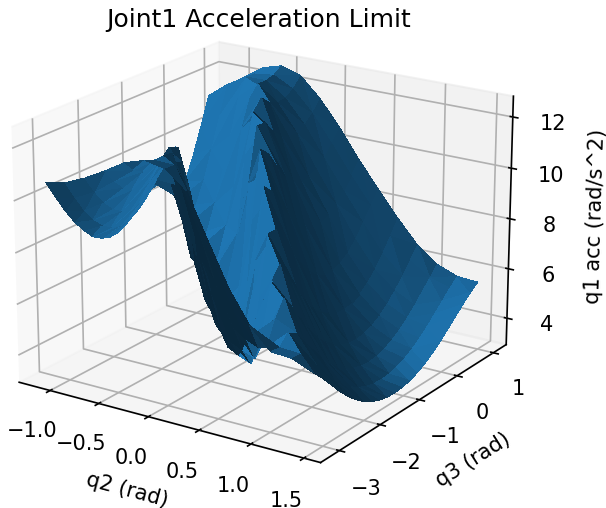
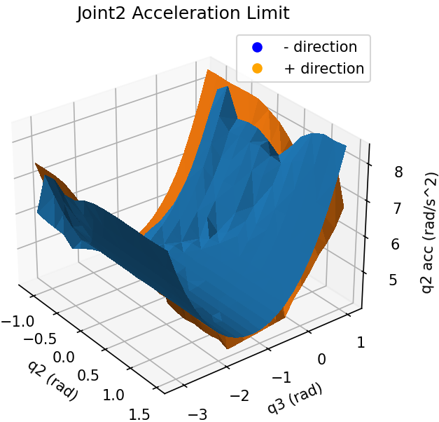
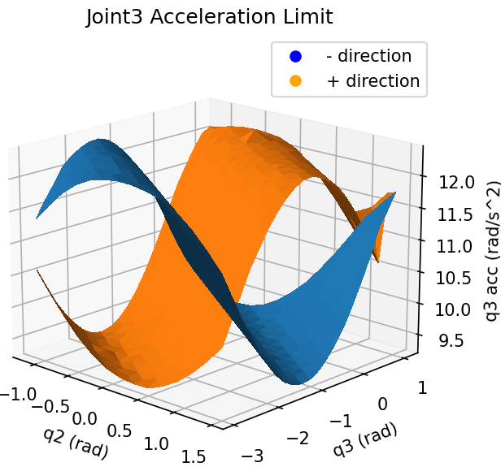

# Robot Joint Acceleration Identification
Capture robot joint acceleration through experimental results.

## Prerequisites
* Robot Motion Program Driver: [ABB](https://github.com/rpiRobotics/abb_motion_program_exec), [FANUC](https://github.com/eric565648/fanuc_motion_program_exec), [Motoman](https://github.com/hehonglu123/dx200_motion_progam_exec)
* [Tesseract](https://github.com/tesseract-robotics/tesseract): Collision Checking Library

## Algorithm

We assume the robot is placed horizontally with base z-axis pointing upward along gravity. Since the arm inertia is most heavily influenced by the shoulder and elbow joints (joints 2 and 3), 
we assume that the spherical wrist joints (joint 4, 5, and 6) have constant joint acceleration limits, while joints 1, 2 and 3 acceleration limits depend on $(q_2,q_3)$, 
the shoulder and elbow joints, and joint 2 and 3 acceleration limits also depend on the direction of vertical motion due to gravity. 

## Results
For Joint 4, 5, and 6, acceleration is stored as constants. For the remaining, a dictionary is used with $(q_2,q_3)$ as keys and $(\ddot{q_1},\ddot{q_2},\ddot{q_3})$ are the value.

## Usage

