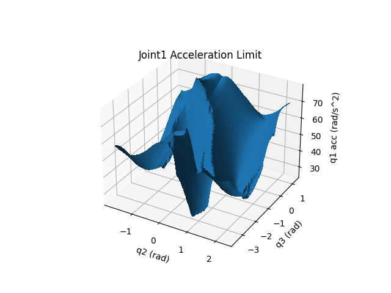

# Robot Joint Acceleration Identification
Capture robot joint acceleration through experimental results.

## Prerequisites
* Robot Motion Program Driver: [ABB](https://github.com/rpiRobotics/abb_motion_program_exec), [FANUC](https://github.com/eric565648/fanuc_motion_program_exec), [Motoman](https://github.com/hehonglu123/dx200_motion_progam_exec)
* [Tesseract](https://github.com/tesseract-robotics/tesseract): Collision Checking Library

## Algorithm

We assume the robot is placed horizontally with base z-axis pointing upward along gravity. Since the arm inertia is most heavily influenced by the shoulder and elbow joints (joints 2 and 3), 
we assume that the spherical wrist joints (joint 4, 5, and 6) have constant joint acceleration limits, while joints 1, 2 and 3 acceleration limits depend on $(q_2,q_3)$, 
the shoulder and elbow joints, and joint 2 and 3 acceleration limits also depend on the direction of vertical motion due to gravity. 

## Results
For Joint 4, 5, and 6, acceleration is stored as constants. For the remaining, a dictionary is used with $(q_2,q_3)$ as keys and $(\ddot{q_1},\ddot{q_2},\ddot{q_3})$ are the value.

| ABB6640                 | 1     | 2     | 3     | 4     | 5     | 6     |
|-------------------------|-------|-------|-------|-------|-------|-------|
| Velocity ($rad/s$)      | 1.745 | 1.571 | 1.571 | 3.316 | 2.443 | 3.316 |
| Acceleration ($rad/s^2$)| *     | *     | *     | 42.5  | 36.8  | 50.5  |

| ABB1200                 | 1     | 2     | 3     | 4     | 5     | 6     |
|-------------------------|-------|-------|-------|-------|-------|-------|
| Velocity ($rad/s$)      | 5.027 | 4.189 | 5.184 | 6.981 | 7.069 | 10.472|
| Acceleration ($rad/s^2$)| *     | *     | *     | 108.2 | 145.4 | 153.5 |

| MA2010                  | 1     | 2     | 3     | 4     | 5     | 6     |
|-------------------------|-------|-------|-------|-------|-------|-------|
| Velocity ($rad/s$)      | 1.745 | 1.571 | 1.571 | 3.316 | 2.443 | 3.316 |
| Acceleration ($rad/s^2$)| *     | *     | *     | 42.5  | 36.8  | 50.5  |

## Usage
An example of Motoman and ABB is included as `motoman.bat` and `abb.bat`:

`python capture_acc.py --robot-name=MA2010_A0 --robot-info-file=config/MA2010_A0_robot_default_config.yml --pulse2deg-file=config/MA2010_A0_pulse2deg.csv --displacement=0.05 --resolution=0.3 --q0-default=0.17 --robot-ip=192.168.1.31 --urdf-path=config/urdf/motoman_cell`
